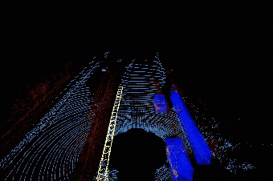

# Point Cloud Processing Pipeline Concept Only

This project demonstrates a LiDAR point cloud processing pipeline with visualization, filtering, ground separation, clustering, and bounding box generation.  

---

## 🖼️ Pipeline Overview

### 1. Visualization with Reflectance  
Reflectance values are mapped to the **red channel** for visual clarity.  

### 2. Filtering by Reflectivity Threshold  
Low-reflectivity points are filtered out.  

### 3. Ground Separation (RANSAC)  
Ground points are removed using **RANSAC plane fitting**.  

### 4. Clustering with DBSCAN  
Objects are clustered using **DBSCAN**.  

### 5. Axis-Aligned Bounding Boxes  
Bounding boxes are generated around each cluster.  

### 6. Final Output
Bounding boxes are generated around each cluster.  

---

## ⚙️ Hardware Setup  
LiDAR hardware used : **Velodyne HDL-64E**  

---

