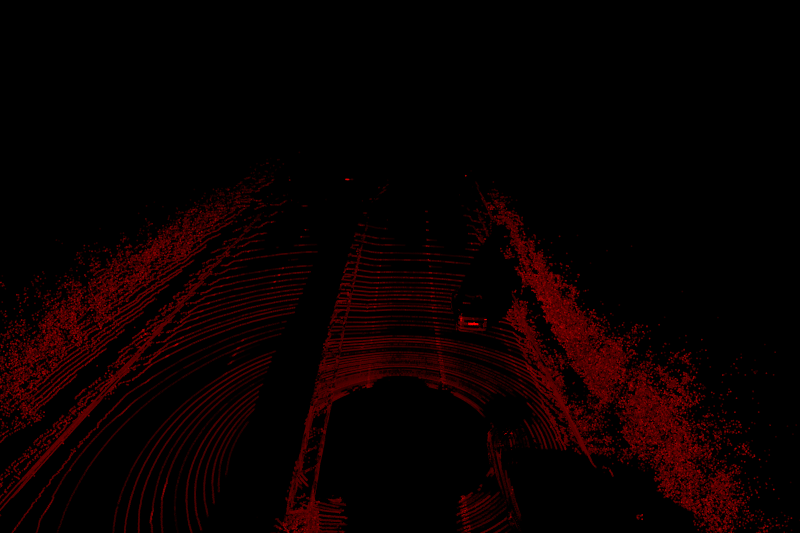
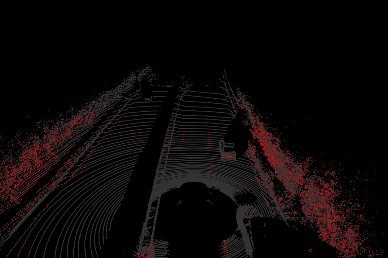
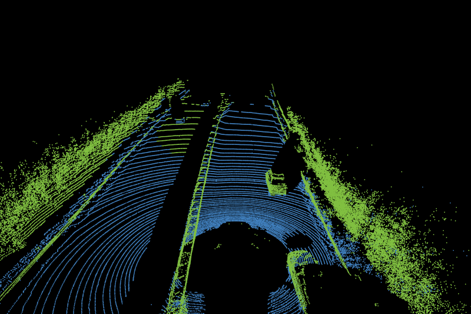
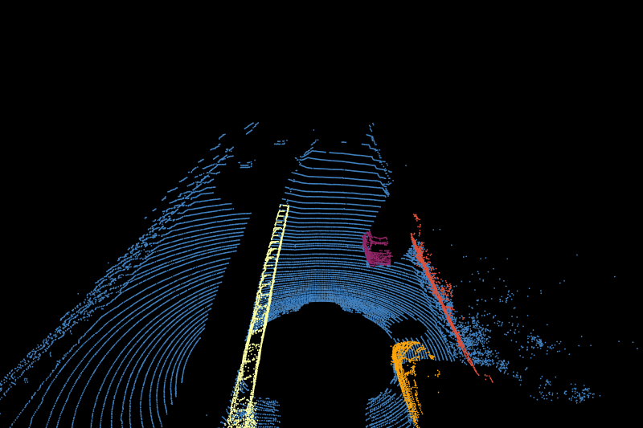
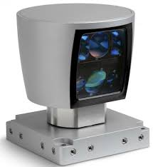

# Point Cloud Processing Pipeline

This project demonstrates a LiDAR point cloud processing pipeline with visualization, filtering, ground separation, clustering, and bounding box generation.  
Everything shown here is unoptimized and for **demonstration purposes only**.  

---

## 🖼️ Pipeline Overview

### 1. Visualization with Reflectance  
Reflectance values are mapped to the **red channel** for visual clarity.  


### 2. Filtering by Reflectivity Threshold  
Low-reflectivity points are filtered out.  


### 3. Ground Separation (RANSAC)  
Ground points are removed using **RANSAC plane fitting**.  


### 4. Clustering with DBSCAN  
Objects are clustered using **DBSCAN**.  


### 5. Axis-Aligned Bounding Boxes  
Bounding boxes are generated around each cluster.  


### 6. Final Output  
The complete processed point cloud with bounding boxes.  
<video src="images/Output.avi" controls width="600"></video>

---

## ⚙️ Hardware Setup  

This project was developed and tested using the following LiDAR hardware:  


---

## 📂 Project Structure (for reference)


```python

```
