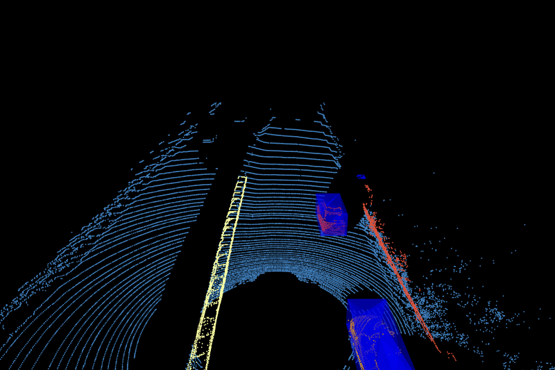

# Point Cloud Processing Pipeline Concept Only

This project demonstrates a LiDAR point cloud processing pipeline with visualization, filtering, ground separation, clustering, and bounding box generation.  

---

## 🖼️ Pipeline Overview

### 1. Visualization with Reflectance  
Reflectance values are mapped to the **red channel** for visual clarity.  


### 2. Filtering by Reflectivity Threshold  
Low-reflectivity points are filtered out.  


### 3. Ground Separation (RANSAC)  
Ground points are removed using **RANSAC plane fitting**.  


### 4. Clustering with DBSCAN  
Objects are clustered using **DBSCAN**.  


### 5. Axis-Aligned Bounding Boxes  
Bounding boxes are generated around each cluster.  


### 6. Final Output  
The complete processed point cloud with bounding boxes.  <br>
[](https://youtu.be/NG4hXilxNBk)

---

## ⚙️ Hardware Setup  

This project was developed and tested using the following LiDAR hardware: **Velodyne HDL-64E** 


---

## 📂 Project Structure (for reference)


```python

```
